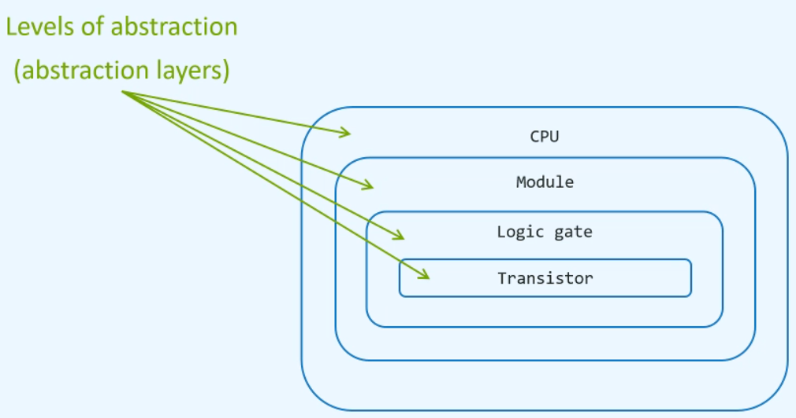
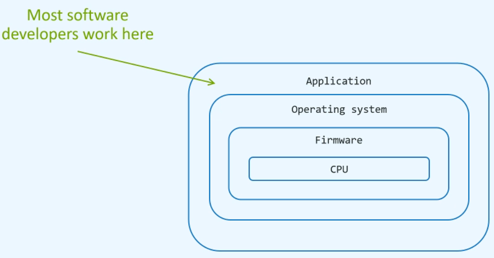
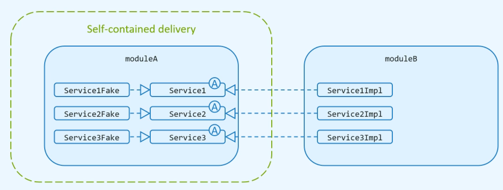

### SOLID

0. Абстракция - альтернативное представление какой-то концепции,
которая скрывает детали внутреннего устройства, а показывает только то, в чем мы заинтересованы (например логические ключи -> это абстракция поверх транзисторов)

1. **S (Single Responsibility principle)**
Определения:
   * :-1: Каждый класс должен обладать только одной ответственностью
   * :-1: Мы должны описать что делает класс без "И"
   * :+1: **Каждый класс должен обладать лишь одной причиной для изменений**
   
   SRP refactor guide:
   1. Выписать все функциональные требования
   2. Проанализировать каждое и выписать возможные изменения в этой функциональности
   3. Выделить все функциональности, которые могут подвергнуться изменениям в будущем, в отдельные классы

2. **O (Open-Closed principle)**
   Определения:
   * :-1: Классы должны быть открыты для расширений(наследование, создание других имплементаций интерфейсов, добавление нового кода в класс)
и закрыты для изменений(класс скомпиллирован и используется клиентами через его API)
   * :+1: **Классы должны зависеть от стабильной абстракции (API), а для расширения создавать новые реализации абстракций**
   
   OCP refactor guide:
   1. Применять OCP только тогда, когда мы уверенны в будущих изменениях и их характере
   2. Проанализировать требования и выписать возможные изменения и выделять их в абстракции

3. **L (Liskov substitution principle)**
   Определения:
   * :+1: **В каждом месте, где используется класс-родитель мы должны без проблем использовать класс-наследник**

    

   **Правила LSP:**
   * Method signature rules
     * Число аргументов сабкласса должно быть такое же, как и у суперкласса, а также 
     тип этих аргументов должен быть таким же или более общим.
     * Тип возвращаемого значения должен быть таким же как и у суперкласса или менее общим.
     * Исключения, которые выбрасывают сабклассы должны быть такими же как и у суперклассов или наследоваться от них.
     
   * Pre- Post- conditions
     * Метод в сабклассе не должен ужесточать пред-условия (аргументы)
     * Метод в сабклассе не должен ослаблять пост-условия (возвр. знач.)
   
   * Class property rules
     * Инварианты, которые гарантирует сабкласс, должны включать в себя все инварианты, которые гарантирует суперкласс
     * Ограничения, которые вводит суперкласс не должны нарушатся сабклассом.
     

4. **I (Interface segregation principle)**
    * :+1: **Клиенты не должны зависеть от методов, которые они не используют**
    

5. **DI (Dependency Inversion principle)**
    * :+1: **Классы верхнего уровня не должны зависеть от классов нижнего уровня, оба уровня должны зависеть от абстракций. Абстракции не должны зависеть от деталей, детали должны зависеть от абстракций**
    
   

   Так же можно выделить абстракции (Service1, Service2, Service3) в отдельный модуль
   
    Плюсы использования DI:
    * Защита кода от дальнейших изменений в требованиях(интерфейсы определены)
    * Переиспользование кода
    * Уменьшение каплинга между модулями